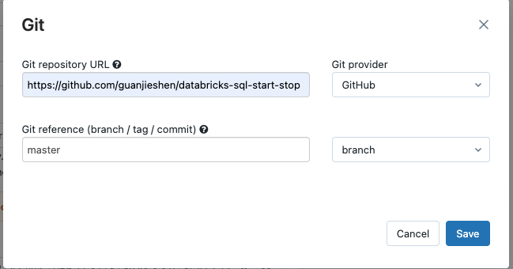

# databricks-sql-start-stop

This repository contains a Databricks notebook that can be used to help schedule and automate the starting, stopping, and configuration of Databricks SQL Warehouses. This solution is designed be used with Databricks Workflows for scheduling and notifications.

This notebook automatically leverages the Databricks PAT of the user or service principal that is running the job; therefore, ensure that this account has permissions to update the SQL Warehouse. 

## How to use this notebook

This notebook should be triggered using Databricks Workflows. Users can either import this notebook (`update_sql_warehouse.py`) into the Databricks Workspace, or use a Git reference to this repository.

Once a job is created, add a task to point to the `update_sql_warehouse.py` notebook. 

Then leverage the Jobs scheduler to set when should this task should be executed:

### Parameters

This notebook uses [Databricks widgets](https://docs.databricks.com/notebooks/widgets.html) to configure the how the SQL warehouse should be updated.

 ###### [Required] `warehouse_id `
 
 This is the unique ID for the SQL warehouse that should be updated.

 

 ###### [Required] `start_stop_update ` 
 This parameter supports to following options:
 - `start`: Start the warehouse.
 - `stop`: Stop the warehouse.
 - `update`: Only update the warehouse definition.

 ###### [Optional] `auto_stop_mins ` 
 This parameter sets the auto-terminate time window. If set to 0, the Warehouse will not be set to never auto-terminate.

 ###### [Optional] `size ` 
 This parameter sets the cluster size: 
 - `XXSMALL`: 2X-Small
 - `XSMALL`: X-Small
 - `SMALL`: Small
 - `MEDIUM`: Medium
 - `LARGE`: :Large
 - `XLARGE`: X-Large
 - `XXLARGE`: 2X-Large
 - `XXXLARGE`: 3X-Large
 - `XXXXLARGE`: 4X-Large

_Changing the cluster size will cause the Warehouse to restart if it is already running._

 ###### [Optional] `min_num_clusters ` 
 This parameter sets the minimum number of clusters in an endpoint. `max_num_clusters` must be >= `min_num_clusters ` 

 ###### [Optional] `max_num_clusters ` 
 This parameter sets the maximum number of clusters in an endpoint. `max_num_clusters` must be >= `min_num_clusters ` 

 ###### [Optional] `spot_instance_policy ` 
 This parameter sets the spot instance policy:
 - `COST_OPTIMIZED`: Use spot instances when possible.
 - `RELIABILITY_OPTIMIZED`: Do not use spot instances.

###### [Optional] `enable_serverless_compute ` 
 This parameter supports to following options:
 - `True`: Use serverless compute.
 - `False`: Use classic compute.

### Starting a SQL Warehouse 

### Stopping a SQL Warehouse 

### Updating a SQL Warehouse 

## Best Practices
- Leverage a Cluster Pool set to use All Spot Instances with the smallest VM
    - Azure: `Standard_F4`
    - AWS: `m4.large`
- Use a __Single Node cluster__ & the Cluster Pool to execute the job

- Use Databricks job features to help with notifications and retries if needed.

- If using Spot Instances, make sure retries is configured in the case eviction occurs.

- When resizing the endpoint i.e SMALL -> LARGE. This will trigger a restart of the endpoint, which will terminate any active queries; therefore use caution when performing a endpoint resize.

- Job/Automated clusters usually take 3-5 minutes to spin up; therefore, account for that extra time when scheduling.
- For help with generating a quartz cron expression, use the following: [Link](https://www.freeformatter.com/cron-expression-generator-quartz.html)

## Example Scenario

Let imagine a scenario where we want to create a SQL Warehouse that is able to dynamically change configurations based on a set schedule.

During core business hours i.e. __7am - 6pm MT Monday to Friday__, this Warehouse should have a size of __X-Large__ and should __not auto-terminate__ based on inactivity. This warehouse should also have have auto-scaling set up such that it can __scale between 1-4 clusters__ within the endpoint if required.

During the __weekend and outside of core business hours on weekdays__, we want to switch to a __Small__ Databricks SQL Warehouse that __auto-terminates after 30 mins of inactivity__. We also want to __turn off auto-scaling__ and leverage __spot instances__ whenever possible.

In addition to these configuration changes, we want to SQL Warehouse to automatically start at 7am Monday to Friday if it is not already started.

_For help with generating a quartz cron expression use the following: [Link](https://www.freeformatter.com/cron-expression-generator-quartz.html)_

In order to implement the follow we will need two Databricks jobs:

__1. Start the Warehouse at 7am on Monday - Friday and update the Warehouse configuration for core hours.__

__2. Update the Warehouse at 6pm on Monday - Friday and modify the Warehouse configuration for non-core hours.__

